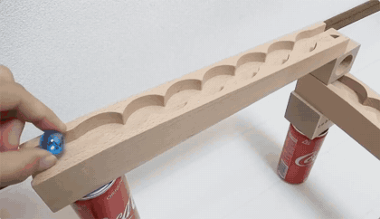
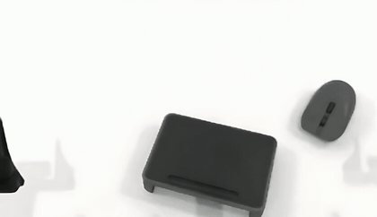
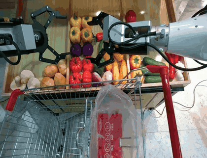

# StrucPhysVideo: Learning Physical Dynamics from Structured Captions and Robot Actions

🌐 [Project Page](https://westlakedi-awomo.github.io/Awomo-WM-Page/) | 📄 [Technical Report](https://github.com/westlake-autolab/Awomo-WM-Technical-Report)

## Overview

StrucPhysVideo is a video world model designed to generate visually coherent sequences that better reflect how objects move, interact, and change state. It combines physically grounded data curation and structured supervision with two complementary generation settings:

- **Text-image-to-video (TI2V):** generates a future video from a reference image and a textual description while preserving the observed scene and modeling its subsequent dynamics.
- **Image-action-to-video (IA2V):** generates robot-view video from a reference image and a sequence of robot actions, connecting commanded motion with the evolution of the visual scene.

The method is developed around a physical data pipeline that retains observable interactions, filters technical and semantic artifacts, and organizes supervision into structured descriptions of scenes, entities, camera behavior, material properties, and temporally localized events. StrucPhysVideo-TI2V combines multimodal reference conditioning with first-frame-constrained flow matching. StrucPhysVideo-IA2V incorporates end-effector action trajectories and supports both bidirectional training and causal rollout generation.

## Highlights

- **Physically grounded supervision.** Structured captions distinguish object behavior from camera motion and describe entities, materials, spatial relationships, and temporal dynamics.
- **Balanced video training.** Dynamic sampling combines general-domain and physics-focused video pools to strengthen physical modeling while retaining broad generation capabilities.
- **Two complementary generation interfaces.** TI2V supports image-and-language-conditioned generation, while IA2V models robot observations conditioned on action trajectories.
- **Strong physical-video performance.** StrucPhysVideo achieves a 45.5% Physics-IQ Verified Score.
- **Embodied-world modeling.** The IA2V formulation connects end-effector commands with visual predictions of robot interaction sequences.

## Generated Video Examples

| Setting | Domain | Preview | Description |
| --- | --- | --- | --- |
| TI2V | General |  | An aerial camera follows a road beside a vivid alpine lake. |
| TI2V | Physical |  | A blue marble rolls down an inclined track under gravity. |
| TI2V | Embodied |  | The robotic arm's right hand transfers a black mouse onto the black tabletop. |
| IA2V | Embodied |  | Two robotic arms manipulate items in and around a shopping cart. |

## TODO

- [ ] Release StrucPhysVideo-TI2V inference code and model weights.
- [ ] Release StrucPhysVideo-TI2V training code.
- [ ] Release StrucPhysVideo-IA2V inference code and model weights.
- [ ] Release StrucPhysVideo-IA2V training code.

Please stay tuned for future updates.
